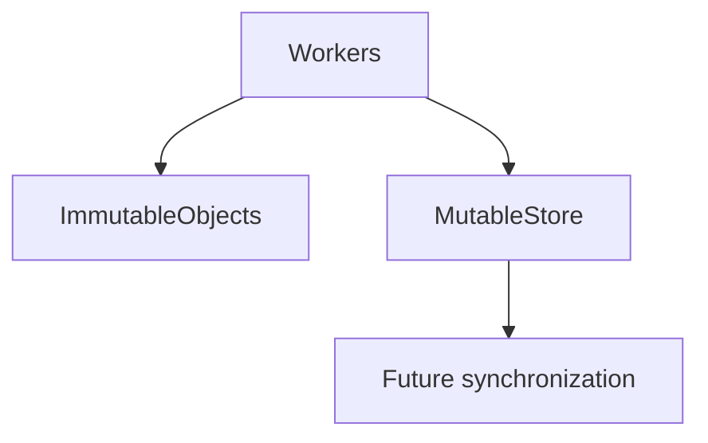
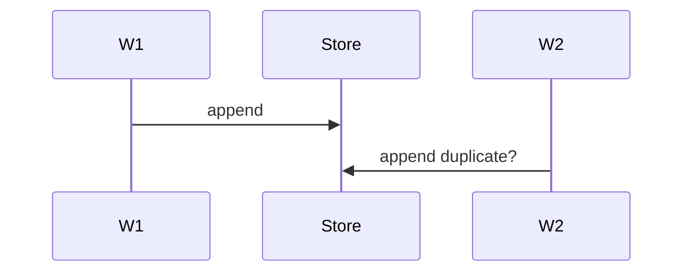

# Concurrency

## Purpose
Define concurrency expectations.
## Scope
Covers thread safety, streaming, stores, caches, and future distributed execution.
## Background
Domain objects are mostly immutable, while stores/caches are mutable.
## Complete Explanation
Immutable observations, measurements, and evidence are safe to share. Mutable registries, stores, streams, and caches require locks or single-writer ownership before concurrent production use.
## Mathematical Foundations
Concurrency correctness depends on idempotent IDs and deterministic functions.
## Architecture Diagrams

## Sequence Diagrams

## Design Decisions
Favor immutable data and stateless evaluators.
## Tradeoffs
Single-threaded execution is simpler; parallelism needs stronger infrastructure.
## Failure Cases
Race conditions in duplicate detection and cache invalidation.
## Edge Cases
Out-of-order streaming updates.
## Complexity Analysis
Concurrency can improve wall time but not algorithmic complexity.
## Current Implementation Status
Not production-concurrency hardened.
## Known Limitations
No explicit locking model.
## Future Improvements
Add async queues, durable offsets, and thread-safe stores.
## Related Documents
[../08_Event_Flow.md](../08_Event_Flow.md)

