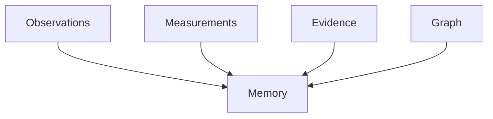
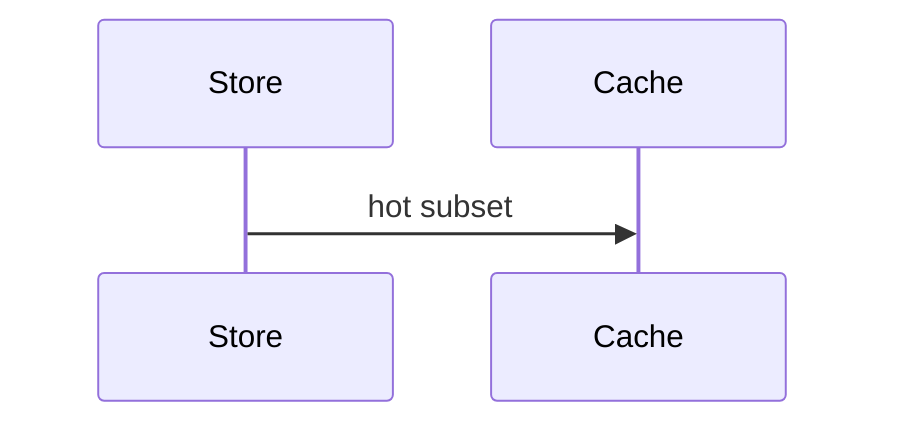

# Memory

## Purpose
Document memory risks and strategy.
## Scope
Covers in-memory objects, caches, stores, graph, and histories.
## Background
The current backend is largely in-memory.
## Complete Explanation
Memory pressure comes from immutable histories, measurement metadata, lineage graphs, evidence packages, and organization graphs.
## Mathematical Foundations
Memory is roughly proportional to object count plus lineage edges: `O(O + M + E + V + R)`.
## Architecture Diagrams

## Sequence Diagrams

## Design Decisions
Keep source records immutable; compress summaries only.
## Tradeoffs
Lineage costs memory but enables audit.
## Failure Cases
Unbounded caches or retaining every intermediate object in showcase context.
## Edge Cases
Large monorepos can multiply file/subsystem nodes.
## Complexity Analysis
O(n) memory for batch processing unless streaming/chunking is added.
## Current Implementation Status
Prototype-scale memory model.
## Known Limitations
No retention policy.
## Future Improvements
Add persisted stores, chunked processing, and cache limits.
## Related Documents
[../measurement_engine/Storage.md](../measurement_engine/Storage.md)

