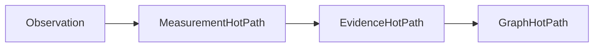
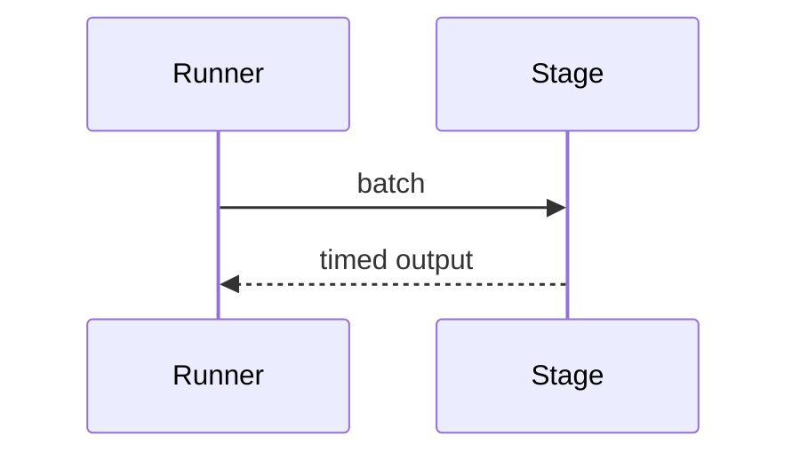

# Performance Guide

## Purpose
Summarize performance expectations and tuning principles.
## Scope
Covers pipeline latency, memory, CPU, concurrency, storage, and graph/forecast costs.
## Background
Current implementation favors clarity and in-memory execution.
## Complete Explanation
Optimize only after preserving layer contracts and lineage. The likely hot paths are measurement evaluation, calibration, evidence grouping/ranking, graph analytics, and repeated scenario runs.
## Mathematical Foundations
Pipeline cost is roughly `O(observations * evaluators + measurements * rules + graph_cost)`.
## Architecture Diagrams

## Sequence Diagrams

## Design Decisions
Measure before optimizing and keep deterministic results stable.
## Tradeoffs
Caching improves speed but increases invalidation complexity.
## Failure Cases
Performance shortcuts that skip validation or lineage.
## Edge Cases
Tiny batches can make calibration overhead dominate.
## Complexity Analysis
See [Complexity.md](Complexity.md).
## Current Implementation Status
No comprehensive benchmark suite yet.
## Known Limitations
No production-scale storage/runtime benchmark.
## Future Improvements
Add p50/p95/p99 metrics and OpenTelemetry.
## Related Documents
[Benchmarks.md](Benchmarks.md), [Concurrency.md](Concurrency.md)

