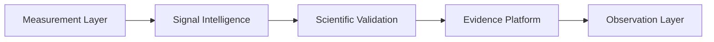

# Design Decisions

## Purpose

List durable architecture decisions and their rationale.

## Scope

Covers canonical decisions made by the current architecture.

## Background

Existing ADRs cover measurement, signal intelligence, scientific validation, evidence intelligence, and observation.

## Complete Explanation

Key decisions:

- Observation is the canonical source of truth.
- Measurement is a separate operating system between Observation and Evidence.
- Evidence is the exclusive bridge to Expertise.
- All decisions need lineage.
- Confidence, uncertainty, quality, validation, provenance, and version are first-class.
- Policies isolate scoring/ranking algorithms.
- Failed research remains documented.

## Mathematical Foundations

Layering maps to clear functions:

```text
Observation -> Measurement -> Evidence -> Expertise -> Decision
f, g, h, pi
```

## Architecture Diagram



## Design Decisions

This document is itself the decision index. Detailed ADRs remain in `docs/architecture/decisions`.

## Tradeoffs

The architecture favors correctness, explainability, and future extension over minimal implementation size.

## Failure Cases

- Decisions exist only in code.
- ADRs do not get updated after implementation diverges.

## Edge Cases

Some decisions are implemented partially and should link to `implementation/Partial.md`.

## Complexity Analysis

Governance-only.

## Current Implementation Status

Five ADRs exist and this bible provides a higher-level index.

## Known Limitations

No ADR template is included here yet.

## Future Improvements

- Add ADR status fields.
- Add links from every gap to relevant decisions.

## Related Documents

- [../../architecture/decisions/0001-measurement-layer.md](../../architecture/decisions/0001-measurement-layer.md)
- [../../architecture/decisions/0005-canonical-observation-layer.md](../../architecture/decisions/0005-canonical-observation-layer.md)

