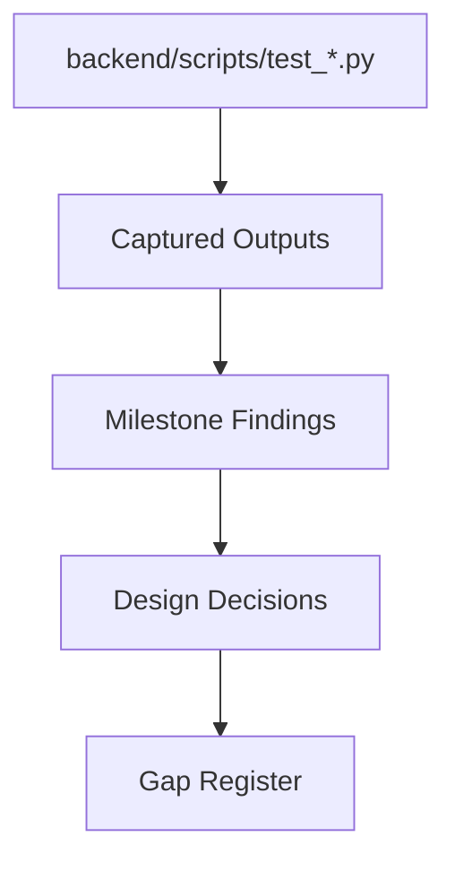

# Experiments

## Purpose

Catalog experiments and validation activity.

## Scope

Covers milestone experiments, showcase pipeline runs, validation scripts, and planned experiments.

## Background

The repo includes many `backend/scripts/test_*.py` scripts, platform showcase outputs, and milestone findings.

## Complete Explanation

Experiment families:

- End-to-end pipeline and platform showcase.
- Measurement engine validation.
- Observation extraction and platform validation.
- Evidence platform validation.
- Expertise mapping and projection.
- Ownership, concentration, coverage, bus-factor, and knowledge risk.
- Forecast, trend, history, health projection, and future risk.
- Simulation, scenarios, interventions, successors, transfer, and executive planning.
- Reasoning agent and grounded agents.

## Mathematical Foundations

Experiments should test:

```text
determinism, calibration, monotonicity, bounded scores, uncertainty propagation,
ranking stability, graph connectivity, forecast error
```

## Architecture Diagram



## Design Decisions

- Keep script-based validation while the product is still architecturally fluid.
- Convert critical scripts into repeatable tests over time.

## Tradeoffs

Scripts are fast to write and inspect. Formal tests provide better regression protection.

## Failure Cases

- Showcase succeeds only with live credentials.
- Regression scripts are not run in CI.
- Outputs are captured but not interpreted.

## Edge Cases

Offline fixtures are needed for repositories that cannot be accessed live.

## Complexity Analysis

Experiment cost depends on data size and external API calls. Offline fixtures should make core validation O(n) over fixture size.

## Current Implementation Status

Many validation scripts exist. M37 notes that calibration and ownership logic need stronger regression tests.

## Known Limitations

No single command appears to run all validation scripts with stable fixtures.

## Future Improvements

- Add fixture-based CI.
- Add benchmark and accuracy reports.
- Record experiment metadata in a table.

## Related Documents

- [Research_Timeline.md](Research_Timeline.md)
- [../performance/Benchmarks.md](../performance/Benchmarks.md)

