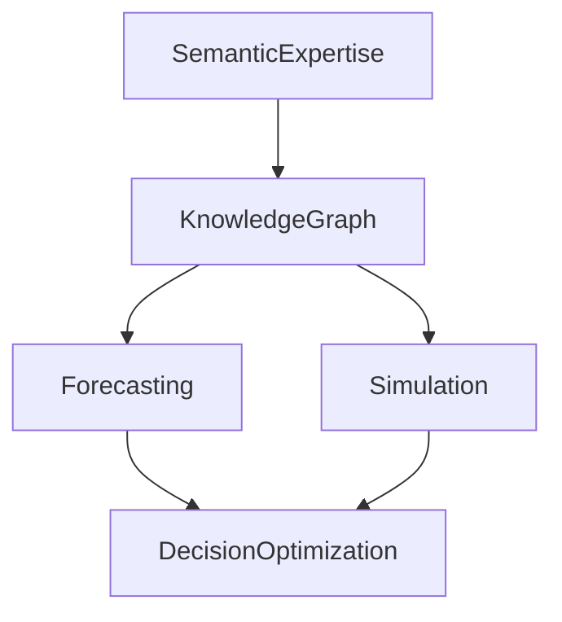

# Future Research

## Purpose

Define research still needed to complete the long-term vision.

## Scope

Covers expertise, knowledge, graph intelligence, forecasting, simulation, reasoning, and decision optimization.

## Background

The scientific foundation is largely in place. The remaining journey is richer intelligence.

## Complete Explanation

Priority research:

- Semantic expertise beyond files.
- Knowledge objects with properties, relationships, history, and confidence.
- Graph centrality, community detection, ownership propagation, and knowledge diffusion.
- Temporal snapshots and trend forecasting.
- Causal and counterfactual reasoning.
- Budget-aware intervention planning.
- Cross-source validation and active measurement.

## Mathematical Foundations

Future models:

```text
Bayesian expertise posterior
dynamic graph G_t
forecast x_{t+k}
counterfactual state x_t do(action)
utility-maximizing intervention plan
```

## Architecture Diagram



## Design Decisions

- Do not rewrite the lower architecture for these research directions.
- Expand semantic models and algorithms above the current foundation.

## Tradeoffs

Advanced inference should wait for enough historical and benchmark data.

## Failure Cases

- Forecasting without enough snapshots.
- Graph algorithms over noisy or incomplete edges.
- Decisions optimized for metrics but not organizational reality.

## Edge Cases

Sparse teams may require qualitative or active observations.

## Complexity Analysis

Future work may introduce iterative graph algorithms, probabilistic inference, and constrained optimization.

## Current Implementation Status

Foundations exist; advanced versions are planned or partial.

## Known Limitations

Research questions outnumber validated datasets.

## Future Improvements

- Create formal experiment plans for each research topic.
- Add acceptance criteria before productionizing algorithms.

## Related Documents

- [../roadmap/Architecture_Roadmap.md](../roadmap/Architecture_Roadmap.md)
- [../gaps/Open_Problems.md](../gaps/Open_Problems.md)

