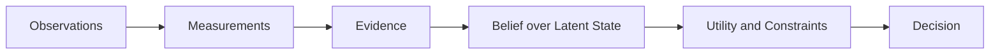

# Mathematical Foundations

## Purpose

Summarize the mathematical ideas behind PIA.

## Scope

Covers latent-state estimation, measurement theory, confidence, uncertainty, decay, graph analysis, forecasting, and decision theory.

## Background

PIA measures observable software work to infer hidden organizational state: expertise, ownership, risk, readiness, knowledge concentration, and future vulnerability.

## Complete Explanation

Core model:

```text
x_t = hidden organizational state
y_t = observed vendor facts
o_t = canonical observations
m_t = measurements
e_t = evidence
k_t = knowledge state
a_t = decision/action
```

The system approximates:

```text
p(x_t | e_1:t)
```

Current code uses deterministic services and policies, while future work can introduce Bayesian updates, Kalman-like state transitions, probabilistic fusion, and decision optimization.

## Mathematical Foundations

Important formulas:

```text
decay = exp(-lambda * age)
weighted_score = sum(w_i * s_i) / sum(w_i)
confidence = product(bounded_factors)
entropy = -sum(p_i log p_i)
gini = sum_i sum_j |x_i - x_j| / (2 n^2 mean(x))
expected_utility(action) = sum_x utility(action, x) p(x)
```

## Architecture Diagram



## Design Decisions

- Keep deterministic measurements as the source of record.
- Put probabilistic reasoning above or after deterministic measurement.
- Attach uncertainty and confidence to outputs instead of assuming certainty.

## Tradeoffs

Deterministic rules are easier to debug. Probabilistic models are more expressive but require calibration data.

## Failure Cases

- Multiplying many confidence factors can over-penalize evidence.
- Small sample calibration can produce unstable percentiles.
- Graph centrality can overvalue noisy hub nodes.

## Edge Cases

- Missing data is evidence of missing observability, not evidence of absence.
- Recent activity may indicate ownership transfer or temporary incident response.

## Complexity Analysis

Simple scoring is O(n). Bayesian and graph algorithms range from O(n) to iterative O(k(V + E)). Optimization can become NP-hard depending on constraints.

## Current Implementation Status

Decay, confidence, calibration, entropy, fusion, graph metrics, trend estimation, and policy scoring exist in early-to-mature forms.

## Known Limitations

No full probabilistic latent state estimator is implemented.

## Future Improvements

- Add calibrated likelihood models.
- Add posterior expertise distributions.
- Add decision utility functions and constraints.

## Related Documents

- [../estimation/Latent_State_Model.md](../estimation/Latent_State_Model.md)
- [../measurement_engine/Measurement_Math.md](../measurement_engine/Measurement_Math.md)

