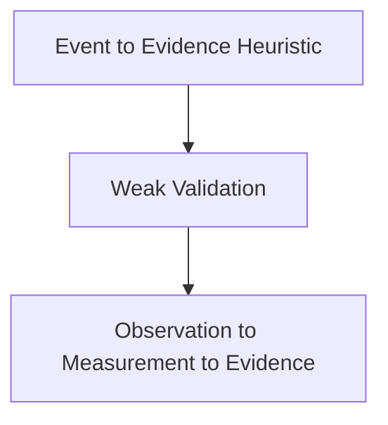

# Rejected Designs

## Purpose

Preserve designs that were abandoned or demoted.

## Scope

Covers known rejected approaches and why they failed.

## Background

The most important rejected architecture is the direct Event -> Evidence pipeline.

## Complete Explanation

### Direct Event -> Evidence

Original problem: infer expertise and risk from software events.

Why investigated: it was simple and produced early useful insights.

Why rejected: weak mathematical foundation, hidden assumptions, poor validation, low traceability, no uncertainty propagation.

Final decision: replace with Observation -> Measurement -> Evidence.

### Evidence Calculates Metrics

Why rejected: evidence should interpret measurements, not compute them.

Final decision: only Measurement computes quantitative values.

### Expertise Reads Measurements Directly

Why rejected: bypasses validation and synthesis, causing inconsistent reasoning.

Final decision: expertise consumes `EvidencePackage.for_expertise()`.

### File-Only Expertise as Final Model

Why rejected: real organizational knowledge lives at developer, subsystem, technology, team, and repository levels.

Final decision: retain file expertise as a signal, not the final semantic model.

## Mathematical Foundations

Rejected designs failed because they conflated:

```text
observation y
measurement m = f(y)
evidence e = g(m)
latent state x
decision a
```

## Architecture Diagram



## Design Decisions

- Never remove failed ideas from history.
- Treat rejections as guardrails for future contributors.

## Tradeoffs

Some rejected designs are faster for prototypes. They are unsafe as canonical architecture.

## Failure Cases

Future contributors may reintroduce shortcuts under new names.

## Edge Cases

Legacy flows may still use rejected patterns for compatibility. They should be marked as legacy.

## Complexity Analysis

Rejected designs were often simpler computationally but more expensive operationally because they created untraceable conclusions.

## Current Implementation Status

Compatibility remains; canonical architecture has moved on.

## Known Limitations

Not every rejected alternative from every milestone is listed yet.

## Future Improvements

- Add entries from all raw research files.
- Link rejected designs to ADRs.

## Related Documents

- [Design_Decisions.md](Design_Decisions.md)
- [../implementation/Deprecated.md](../implementation/Deprecated.md)

