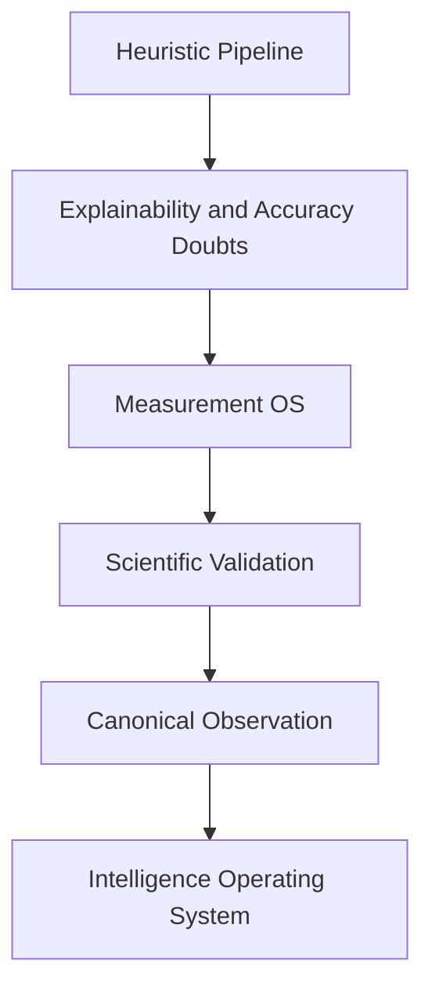

# Research Diary

## Purpose

Record the reasoning process of the original architecture evolution.

## Scope

Captures decisions, rejected ideas, mistakes, philosophy changes, breakthroughs, and open questions.

## Background

The key philosophical change was realizing that useful engineering dashboards are not enough: PIA needs scientifically defensible measurements and explainable inference.

## Complete Explanation

Diary highlights:

- Early useful insight came from commits, files, evidence, and expertise.
- The first mistake was allowing heuristic evidence to carry too much semantic weight.
- The breakthrough was introducing Measurement as a separate layer between Observation and Evidence.
- The second breakthrough was making Observation vendor-neutral and immutable.
- M37 showed that measurement populations need calibration and evidence rules should be evaluated per target entity.

## Mathematical Foundations

The diary increasingly converges on uncertainty-aware inference:

```text
confidence_total = confidence_source * confidence_measurement * confidence_evidence * confidence_reasoning
```

Each layer must expose its uncertainty rather than hide it.

## Architecture Diagram



## Design Decisions

- Document mistakes instead of erasing them.
- Prefer explicit contracts over clever shortcuts.
- Let richer intelligence come from better semantic models, not deeper plumbing.

## Tradeoffs

Writing down uncertainty can make the project look less complete, but it makes engineering decisions safer.

## Failure Cases

- Treating current demos as proof of production readiness.
- Forgetting why Event -> Evidence was replaced.

## Edge Cases

Some old heuristics still provide useful baselines and should be retained as deprecated or legacy comparisons.

## Complexity Analysis

Not applicable to runtime; applies to project memory.

## Current Implementation Status

The diary is now initialized. Future milestones should append dated entries.

## Known Limitations

This first diary condenses history from existing docs and does not reproduce every raw milestone note.

## Future Improvements

- Add dated entries after each milestone.
- Record experiment IDs and result links.

## Related Documents

- [Rejected_Designs.md](Rejected_Designs.md)
- [Tradeoff_Analysis.md](Tradeoff_Analysis.md)
- [../appendix/Architect_Notes.md](../appendix/Architect_Notes.md)

