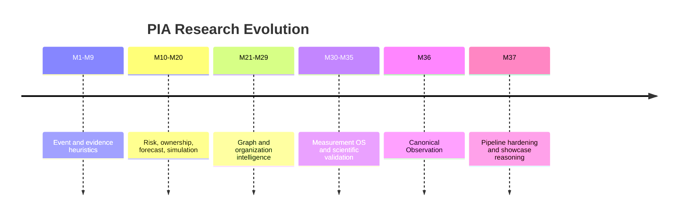

# Research Timeline

## Purpose

Preserve the chronological evolution of PIA research.

## Scope

Covers milestone research notes, architecture migrations, major findings, and remaining questions.

## Background

Research files exist for milestones 2 through 30 and 37, plus research accuracy foundation volumes. This document indexes the story rather than replacing the raw files.

## Complete Explanation

Timeline summary:

- M1-M9: events, evidence extraction, expertise, ownership, and basic risk.
- M10-M20: organization services, forecasting, simulation, health, transfer, and executive planning started to emerge.
- M21-M29: graph, organization intelligence, platform hardening, and broader service coverage expanded.
- M30-M35: Measurement Operating System, signal intelligence, scientific validation, and evidence intelligence became the scientific core.
- M36: canonical Observation Layer replaced Event as the production source abstraction.
- M37: evidence synthesis, measurement calibration, subsystem/developer attribution, reasoning handoff, and showcase pipeline were hardened.

## Mathematical Foundations

The timeline reflects a shift from heuristic extraction to state estimation:

```text
raw activity -> evidence heuristics -> expertise estimates
canonical observations -> measurements -> evidence -> latent organizational state
```

## Architecture Diagram



## Design Decisions

- Keep every milestone finding.
- Treat failed designs as architectural memory.
- Convert repeated research conclusions into explicit gaps and roadmap items.

## Tradeoffs

A timeline can simplify nuance. Raw milestone files remain authoritative for detailed historical notes.

## Failure Cases

- Future work repeats abandoned heuristic shortcuts.
- Research assumptions get copied into production without validation.

## Edge Cases

Milestones without research files should still be represented through milestone docs and source code.

## Complexity Analysis

Research tracking is governance work; runtime complexity is not applicable.

## Current Implementation Status

Raw research is present under `research/` and deeper research foundation volumes under `docs/Research Accuracy Milestones/`.

## Known Limitations

Not every experiment has numeric outputs captured in a durable table.

## Future Improvements

- Add a machine-readable research index.
- Link each design decision to code and tests.

## Related Documents

- [Research_Diary.md](Research_Diary.md)
- [Experiments.md](Experiments.md)
- [Design_Decisions.md](Design_Decisions.md)

