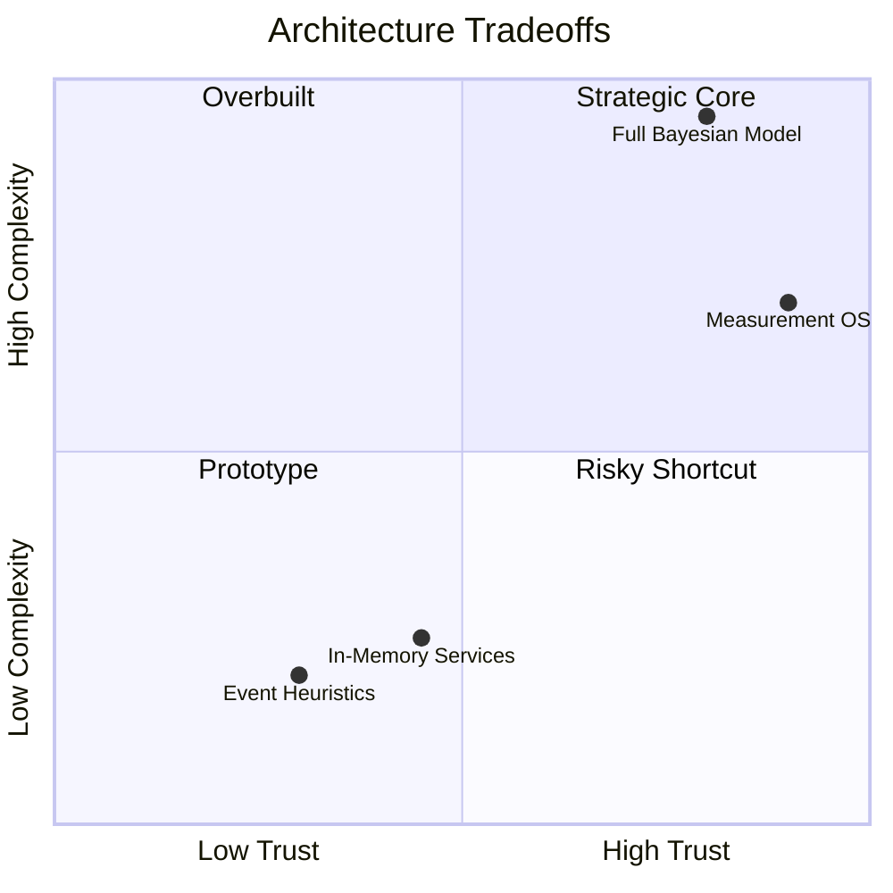

# Tradeoff Analysis

## Purpose

Record major architectural tradeoffs.

## Scope

Covers accuracy, speed, complexity, extensibility, explainability, and implementation maturity.

## Background

PIA repeatedly chose architecture discipline over heuristic convenience.

## Complete Explanation

Major tradeoffs:

- Canonical layers vs quick pipeline: more code, stronger trust.
- Deterministic measurement vs ML-first inference: less flexible, more reproducible.
- Immutable history vs mutable summaries: more storage, better audit.
- Rule-based reasoning vs probabilistic reasoning: easier now, less expressive.
- In-memory services vs persisted platform: faster iteration, limited scale.

## Mathematical Foundations

Tradeoffs often reduce to utility under constraints:

```text
choose design d maximizing trust(d) + extensibility(d) - cost(d) - complexity(d)
```

## Architecture Diagram



## Design Decisions

- Accept complexity in lower layers where it creates trust.
- Avoid complexity in upper layers until richer data exists.

## Tradeoffs

This whole document is the tradeoff register.

## Failure Cases

- Overbuilding probabilistic models without validation data.
- Underbuilding lineage and losing trust.

## Edge Cases

Prototype scripts can use simpler flows when clearly marked non-canonical.

## Complexity Analysis

Each added layer adds integration cost but reduces semantic entanglement.

## Current Implementation Status

Lower layers accept complexity; upper layers are intentionally simpler.

## Known Limitations

Tradeoffs are qualitative today.

## Future Improvements

- Add quantitative cost, latency, and accuracy comparisons.

## Related Documents

- [Rejected_Designs.md](Rejected_Designs.md)
- [../performance/Complexity.md](../performance/Complexity.md)

