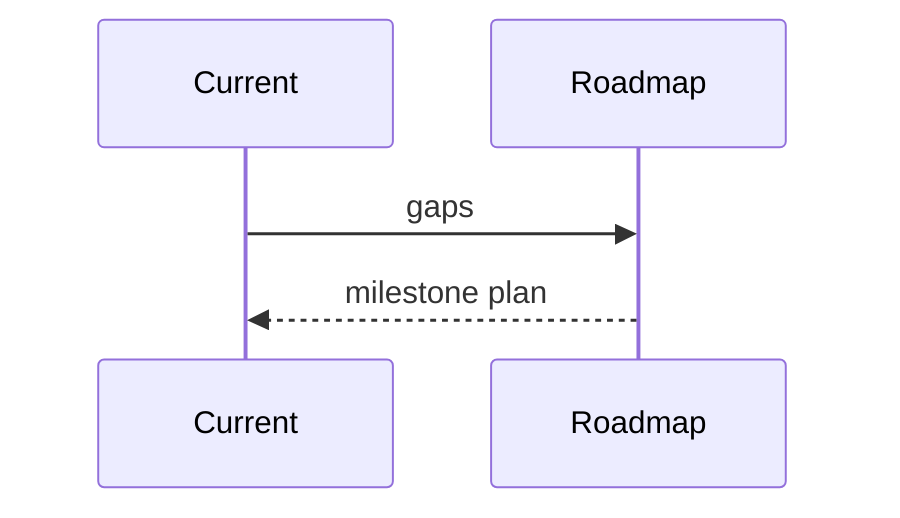

# Architecture Roadmap

## Purpose
Define the path from current platform to full intelligence OS.
## Scope
Covers V2 through ultimate vision.
## Background
The foundation is complete enough that future work should enrich upper layers.
## Complete Explanation
Roadmap: expand measurement/evidence definitions, redesign expertise semantically, build knowledge graph, add graph analytics, persist temporal snapshots, validate forecasting, improve reasoning, optimize decisions, harden SaaS operations.
## Mathematical Foundations
Roadmap advances from deterministic scoring to probabilistic state estimation and utility optimization.
## Architecture Diagrams

## Sequence Diagrams

## Design Decisions
Do not rewrite Observation/Measurement/Evidence foundations without evidence of architectural failure.
## Tradeoffs
Incremental enrichment is slower than a rewrite but safer.
## Failure Cases
Building advanced reasoning before semantic inputs improve.
## Edge Cases
Customer-specific packs may alter prioritization.
## Complexity Analysis
Roadmap complexity increases as graph and optimization work begins.
## Current Implementation Status
Roadmap initialized.
## Known Limitations
No dates or owners assigned here.
## Future Improvements
Convert to milestones with acceptance criteria.
## Related Documents
[Version2.md](Version2.md), [Ultimate_Vision.md](Ultimate_Vision.md)

