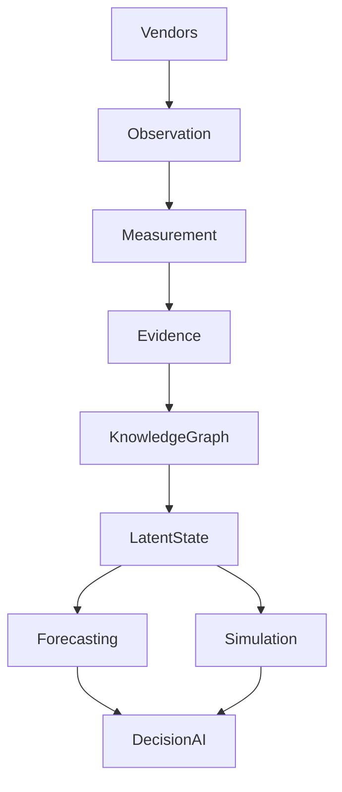
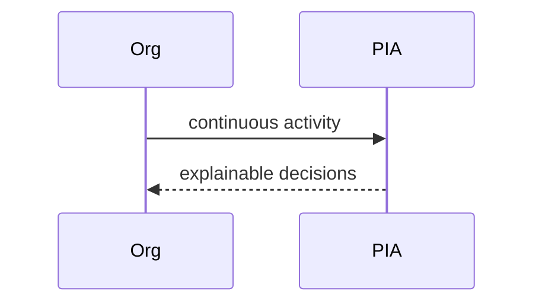

# Ultimate Vision

## Purpose
Describe the end-state PIA system.
## Scope
Long-term architecture and product capability.
## Background
PIA should become an Organizational Intelligence Operating System.
## Complete Explanation
Ultimate PIA continuously observes engineering reality, measures it scientifically, builds explainable evidence, maintains organizational memory, simulates futures, reasons causally, and recommends actions with confidence, cost, and impact.
## Mathematical Foundations
Full vision combines measurement theory, Bayesian state estimation, dynamic graphs, causal inference, forecasting, and decision theory.
## Architecture Diagrams

## Sequence Diagrams

## Design Decisions
Trust, traceability, and uncertainty remain non-negotiable.
## Tradeoffs
This vision is ambitious and requires staged validation.
## Failure Cases
Becoming a black-box executive recommender.
## Edge Cases
Organizations with low observable signal require active/qualitative measurement.
## Complexity Analysis
Ultimate system includes streaming, graph, probabilistic, and optimization workloads.
## Current Implementation Status
Foundation implemented, intelligence incomplete.
## Known Limitations
Long-term vision exceeds current code.
## Future Improvements
Use this as a north star for milestone planning.
## Related Documents
[../01_Project_Vision.md](../01_Project_Vision.md)

