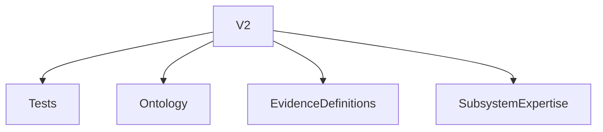
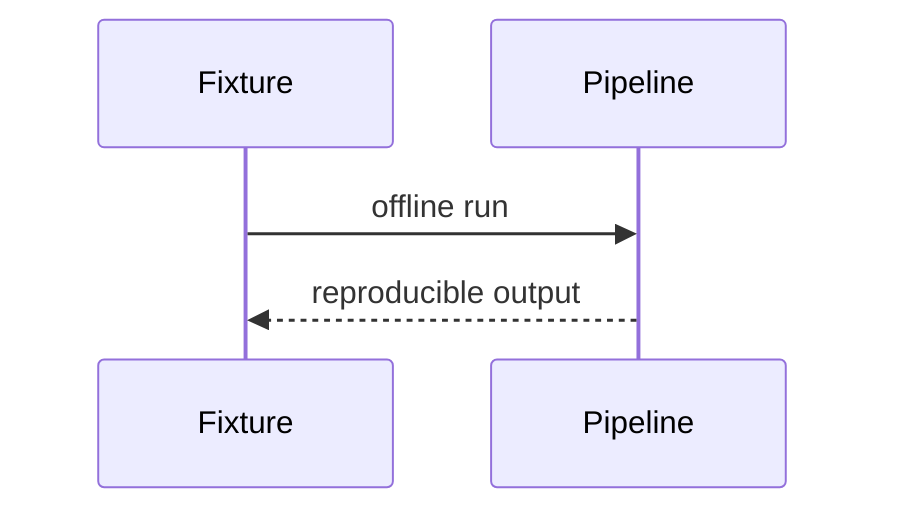

# Version 2

## Purpose
Define the next practical version.
## Scope
Near-term post-M37 work.
## Background
M37 hardened the canonical pipeline and showcase.
## Complete Explanation
V2 should focus on regression tests, offline fixtures, expanded measurement ontology, expanded evidence definitions, subsystem expertise, CODEOWNERS/team integration, and persistent snapshots.
## Mathematical Foundations
Add stronger calibration rules and confidence validation.
## Architecture Diagrams

## Sequence Diagrams

## Design Decisions
Prioritize hardening and semantic breadth.
## Tradeoffs
Less flashy than new AI reasoning, more valuable for trust.
## Failure Cases
Skipping fixtures keeps live-token fragility.
## Edge Cases
Small repos need different thresholds.
## Complexity Analysis
Mostly linear additions.
## Current Implementation Status
Planned.
## Known Limitations
No implementation schedule here.
## Future Improvements
Promote V2 items into milestone docs.
## Related Documents
[../research/Future_Research.md](../research/Future_Research.md)

