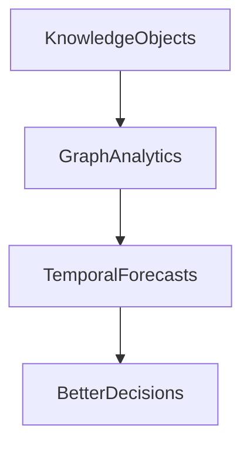
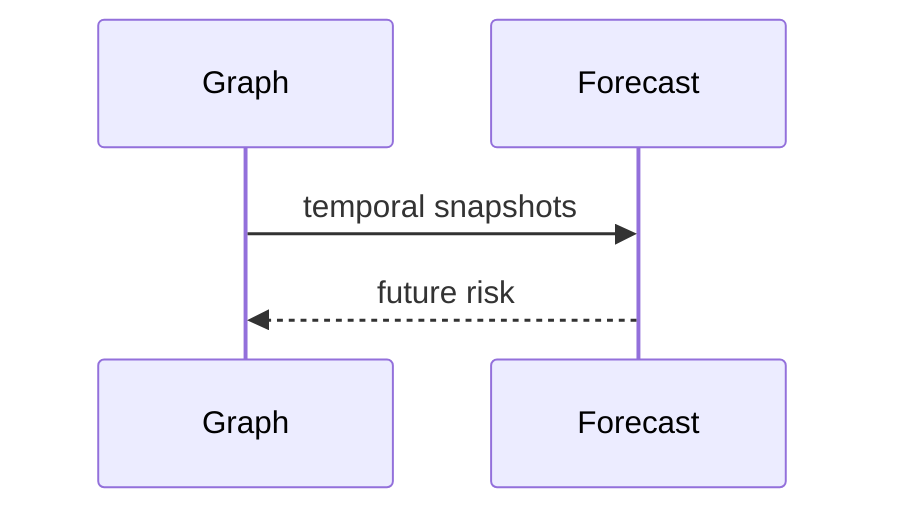

# Version 3

## Purpose
Define medium-term semantic intelligence.
## Scope
Knowledge graph, graph analytics, richer expertise, and temporal intelligence.
## Background
The roadmap identifies upper layers as the main remaining journey.
## Complete Explanation
V3 should introduce first-class knowledge objects, graph-backed expertise, centrality, community detection, risk propagation, historical trend storage, and forecast validation.
## Mathematical Foundations
Dynamic graph `G_t`, PageRank-like expertise, trend models, and confidence intervals.
## Architecture Diagrams

## Sequence Diagrams

## Design Decisions
Use explainable graph algorithms before graph ML.
## Tradeoffs
Graph richness requires better edge validation.
## Failure Cases
Noisy graph edges drive false conclusions.
## Edge Cases
Disconnected team graphs require local analysis.
## Complexity Analysis
Graph algorithms range O(V+E) to O(VE).
## Current Implementation Status
Planned/partial.
## Known Limitations
Requires persisted snapshots.
## Future Improvements
Add graph database evaluation.
## Related Documents
[../graph/Graph_Algorithms.md](../graph/Graph_Algorithms.md)

