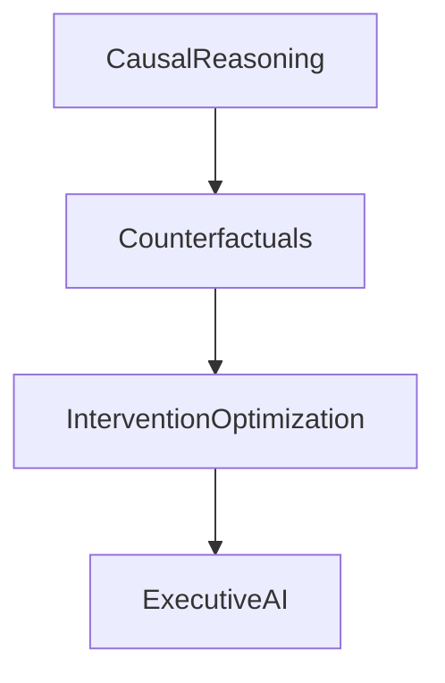
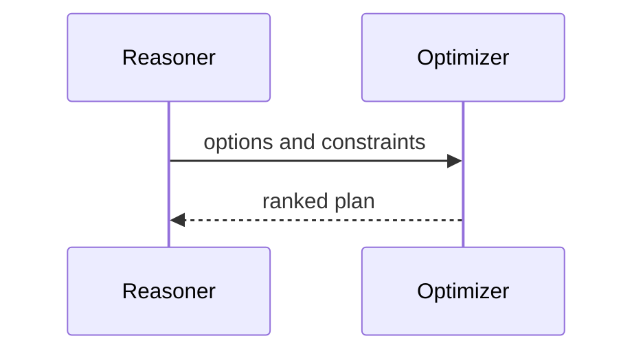

# Version 4

## Purpose
Define advanced reasoning and decision intelligence.
## Scope
Causal reasoning, counterfactuals, budget-aware planning, and intervention optimization.
## Background
Decision services exist but are mostly rule-based.
## Complete Explanation
V4 should answer why, what caused this, what happens next, what if a person leaves, and what is the cheapest effective intervention.
## Mathematical Foundations
Expected utility, constrained optimization, causal/counterfactual models.
## Architecture Diagrams

## Sequence Diagrams

## Design Decisions
Only optimize decisions over validated knowledge and explicit constraints.
## Tradeoffs
Optimization increases power and risk of false precision.
## Failure Cases
Optimizing proxy metrics instead of organizational outcomes.
## Edge Cases
Human constraints may dominate mathematical optimum.
## Complexity Analysis
Constrained planning may be combinatorial.
## Current Implementation Status
Planned.
## Known Limitations
Need validated utility functions.
## Future Improvements
Add decision audits and human override records.
## Related Documents
[Ultimate_Vision.md](Ultimate_Vision.md)

