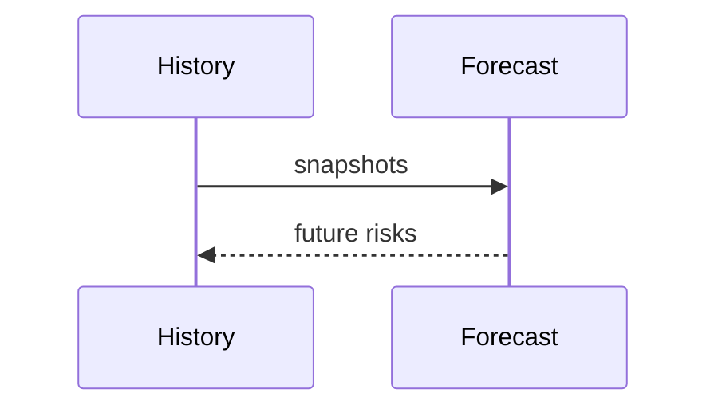

# Simulation Forecasting

## Purpose
Document forecasting used by scenarios and future risk.
## Scope
Covers trend, forecast, severity, pipeline, and future risk services.
## Background
Forecasting currently uses simple policies and needs more historical snapshots.
## Complete Explanation
Forecasting turns historical health/risk/expertise values into projected future risks and severities.
## Mathematical Foundations
Linear forecast: `future = current + slope * horizon`.
## Architecture Diagrams

## Sequence Diagrams

## Design Decisions
Use explainable policies until data supports richer models.
## Tradeoffs
Simple forecasts are transparent but fragile.
## Failure Cases
Forecast from one snapshot, trend breaks, or reorg discontinuities.
## Edge Cases
Seasonal release cycles can look like risk spikes.
## Complexity Analysis
O(n) over snapshots for simple forecasts.
## Current Implementation Status
Forecast services and scripts exist.
## Known Limitations
Limited persistent history.
## Future Improvements
Add probabilistic forecasts and validation against future observations.
## Related Documents
[../estimation/Forecasting.md](../estimation/Forecasting.md)

