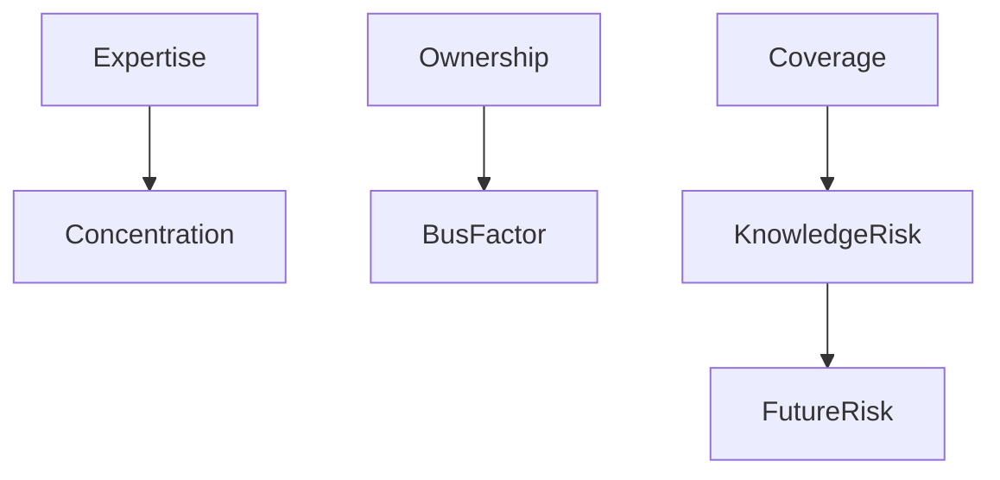
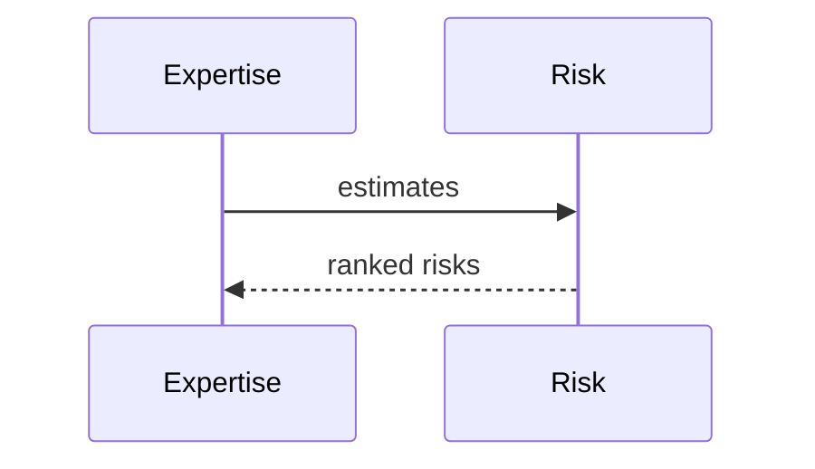

# Risk Model

## Purpose
Explain risk modeling in forecasting and simulation.
## Scope
Covers bus factor, knowledge risk, concentration, health, readiness, and future risk.
## Background
Risk services were built before the canonical measurement migration and are being connected upward through evidence and graph intelligence.
## Complete Explanation
Risk is a function of expertise concentration, ownership concentration, lack of coverage, low readiness, unhealthy trends, and dependency impact.
## Mathematical Foundations
`risk = severity * likelihood * confidence`, with future work adding expected loss.
## Architecture Diagrams

## Sequence Diagrams

## Design Decisions
Represent risks as ranked, explainable objects rather than opaque scores.
## Tradeoffs
Simple risk scoring is usable but not full expected-loss modeling.
## Failure Cases
Risk scores without confidence cause overreaction.
## Edge Cases
High concentration may be acceptable for stable low-criticality code.
## Complexity Analysis
O(n log n) for ranked risks.
## Current Implementation Status
Bus factor, knowledge risk, concentration, organization risk, future risk, and health risk services exist.
## Known Limitations
Needs graph and business impact weighting.
## Future Improvements
Add expected loss and intervention ROI.
## Related Documents
[../gaps/Risks.md](../gaps/Risks.md)

