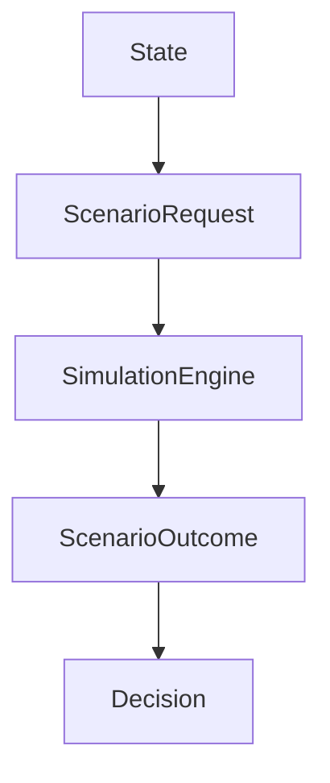
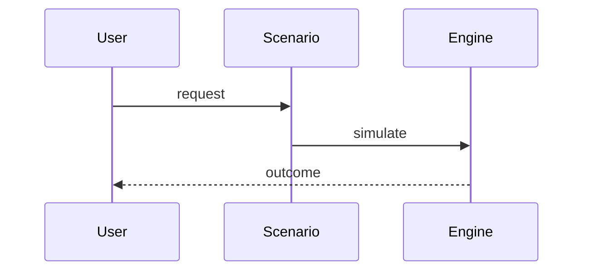

# Scenario Engine

## Purpose
Explain scenario and simulation architecture.
## Scope
Covers departure, intervention, strategy, readiness, and integrated simulation.
## Background
PIA uses scenarios to answer "what if" questions about organizational risk.
## Complete Explanation
Scenario services accept requests, apply policies, simulate changed state, and return outcomes for comparison and decisions.
## Mathematical Foundations
Counterfactual form: `outcome = simulate(state, do(action))`.
## Architecture Diagrams

## Sequence Diagrams

## Design Decisions
Keep scenario types explicit instead of one opaque simulator.
## Tradeoffs
Explicit services are easier to reason about but duplicate orchestration.
## Failure Cases
Simulations over simplistic state produce false precision.
## Edge Cases
Multiple simultaneous departures may have nonlinear effects.
## Complexity Analysis
O(s * model_cost) for s scenarios.
## Current Implementation Status
Scenario and simulation services exist.
## Known Limitations
Models are simple and need graph-backed state.
## Future Improvements
Add confidence intervals and multi-action optimization.
## Related Documents
[Risk_Model.md](Risk_Model.md)

